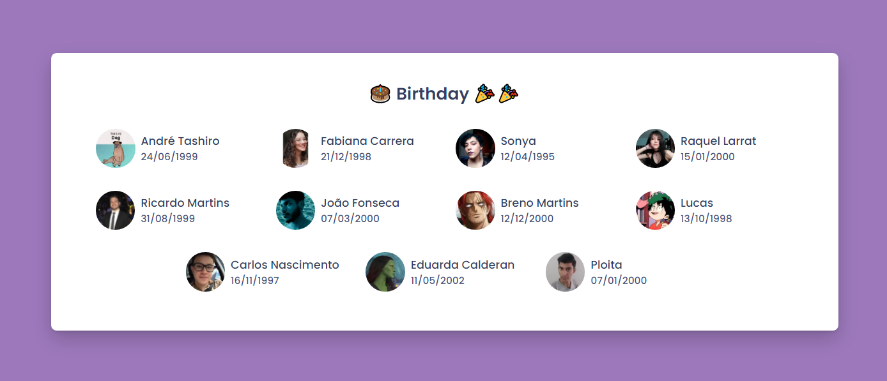

# Twitter Trends React

    
    
    
    

> React application that shows the birthdays of specials friends

## 🚀 How to use the project

### 🛹 Clone the repo

`git clone https://github.com/andreseichi/birthday-reminder-react.git`

### 📒 Access the repo

`cd birthday-reminder-react`

### 🧭 Install all dependencies with yarn

`yarn install`

### 🐾 Fill with your friends's birthdays

Edit `data.ts` inside `src/services` with your friends's birthdays

### 🔨 Build it

`yarn build`
